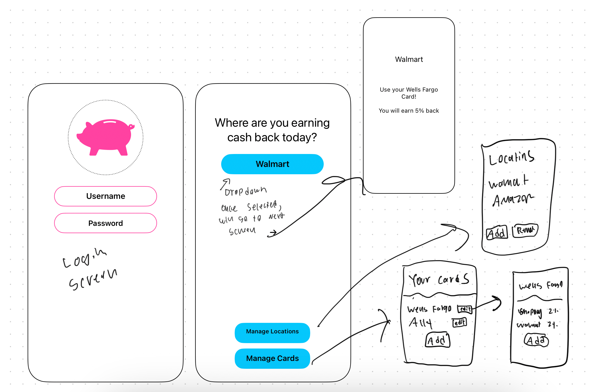

# Startup
Get the highest cash back wherever you shop! 

### Elevator Pitch

Cash back has been around for years, but it continues to be a major way for people to save money on expenses. 
With most people owning more than one credit card, it can be difficult and time consuming to find out which 
credit card to use when they are buying groceries, shopping online, or eating out. And when the waiter asks 
for the check, it's too late to open all of your credit card apps and see which gives the highest cash back 
at Texas Roadhouse. CashCard makes getting the most cash back a simple and easy process. The ability to easily
add your favorite places and each of your credit cards makes it easy. 

### Design

### Key Features
- Secure Login
- Add/remove credit cards with associated cash back for each location
- Add/remove locations to shop at
- Quick access to best card to use for a particular location
- Cards and locations are stored
- See a list of most popular card-location combos used worldwide

### Technologies

- HTML: 3-5 HTML pages for structure. Login, main page, and then location and card manage pages. 
- CSS: Styling that will help the user know exaclty how to use the application. Good space and colors.
- Javascript: Changes html and css when user inputs information. Makes backend calls. 
- React: Used to help build a simple view that will be very responsive to the users inputs
- Web Service: Endpoints for saving cards, saving locations, getting cards, getting locations, also one additional
 outside api call to a outside api that I haven't determined yet. 
- Authentication: Allow user to login and enter a password
- Database: store the users cards and locations. Also stores at what locations users make purchases. 
- Websocket Data: Show the most popular card-location combos on a chart. Each time a user makes a purchase at a location it 
will add this to a chart.  

## CSS deliverable

For this deliverable I properly styled the application into its final appearance.

- [x] **Header, footer, and main content body** added main.css to every page. 
-Login page now has colors and it is aligned center. I also made the header pink and centered. Made the footer pink and centered as well. The main content of the main page has been styled. 
- [x] **Navigation elements** - All navigation buttons are pink with black text and a border radius. The navigation menu is on the bottom of the main page. 
- [x] **Responsive to window resizing** - My app looks great on all window sizes and devices. It should scale automatically. 
- [x] **Application elements** - Used good contrast and whitespace
- [x] **Application text content** - Consistent fonts. 
- [x] **Application images** - Navigation buttons have icons that are svgs. 

## 🚀 React part 1: Routing deliverable

For this deliverable I did the following. I checked the box `[x]` and added a description for things I completed.

- [x] **Bundled using Vite** - I did this
- [x] **Components** - Moved them all over! 
- [x] **Router** - Routing between all pages

## React Phase 2: Reactivity deliverable

For this deliverable I used JavaScript and React so that the application completely works for a single user. I also added placeholders for future technology. My random dog fact api and also my leaderboard page. 

- [x] **All functionality implemented or mocked out** - Everything is working! Cards and locations are stored on local storage.
- [x] **Hooks** - Used `useState` and `useEffect` on most pages.

## Service deliverable

For this deliverable I added backend endpoints that store cards, locations, and cashback amounts!

- [x] **Node.js/Express HTTP service** - done!
- [x] **Static middleware for frontend** - done!
- [x] **Calls to third party endpoints** - Calls kanye west quotes
- [x] **Backend service endpoints** - Login, cards, locations endpoints
- [x] **Frontend calls service endpoints** - Fetch used to call these
- [x] **Supports registration, login, logout, and restricted endpoint**

## DB/Login deliverable

For this deliverable I store the users data on the database

- [x] **Stores data in MongoDB** - done!
- [x] **Use MongoDB to store credentials** - Stores both user and their cards and locations.

## Web Sockets

For this deliverable I added web sockets to get the top store

- [x] **Stores data for top store** - done!
- [x] **Uses web sockets to get an additional purchase and show it to user** - done!